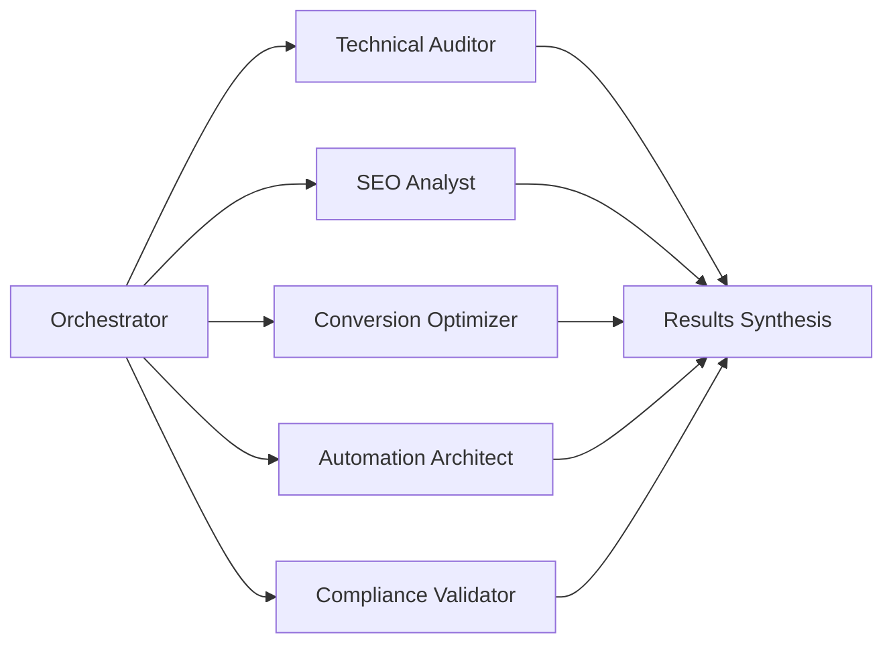

# LION CONSULTORIA - MARKETING AUDIT FRAMEWORK
## Powered by Claude Code MCP Orchestration

---

## 🎯 AUDIT OBJECTIVE
Comprehensive marketing technology stack analysis for Lion Consultoria using advanced Claude Code orchestration with MCP servers and specialized subagents.

### **Business Context**
- **Company**: Lion Consultoria - Premium Marketing Automation
- **Target**: CEOs/CMOs with R$500k-200M/year revenue
- **Goal**: Identify automation opportunities with 300%+ ROI potential

---

## 🤖 AGENT ORCHESTRATION ARCHITECTURE

### **Primary Orchestrator (Main Claude Session)**
- **Role**: Project Manager & Integration Architect
- **Context**: Full 200k token window for coordination
- **Tools**: All native tools + MCP servers coordination
- **Responsibility**: Delegate, synthesize, and optimize workflow

### **Specialized Subagents**

#### 1. **Technical Auditor Agent**
- **Focus**: Infrastructure, performance, security analysis
- **Tools**: Grep, Glob, filesystem MCP, performance profilers
- **Output**: `results/technical_audit.md`

#### 2. **SEO & Content Analyst Agent**
- **Focus**: SEO optimization, content quality, keyword analysis
- **Tools**: WebSearch, Context7 MCP for documentation
- **Output**: `results/seo_analysis.md`

#### 3. **Conversion Optimizer Agent**
- **Focus**: Funnel analysis, UX/UI, A/B testing opportunities
- **Tools**: Playwright MCP for visual testing, analytics APIs
- **Output**: `results/conversion_audit.md`

#### 4. **Automation Architect Agent**
- **Focus**: Identify automation opportunities, ROI calculations
- **Tools**: Serena MCP for code analysis, calculation engines
- **Output**: `results/automation_opportunities.md`

#### 5. **Compliance Validator Agent**
- **Focus**: LGPD compliance, security, data protection
- **Tools**: Security scanners, compliance checkers
- **Output**: `results/compliance_report.md`

---

## 📊 AUDIT METHODOLOGY

### **Phase 1: Discovery (Parallel Execution)**


### **Phase 2: Analysis**
- Cross-reference findings across all agents
- Identify critical gaps and opportunities
- Calculate ROI projections for each recommendation

### **Phase 3: Prioritization**
- **Quick Wins**: <48h implementation, immediate impact
- **Strategic Initiatives**: 2-4 weeks, high ROI
- **Long-term Projects**: 1-3 months, transformational

### **Phase 4: POC Development**
- Select top 3 opportunities
- Develop working prototypes
- Demonstrate measurable impact

---

## 🎯 KEY PERFORMANCE INDICATORS

### **Technical Metrics**
- Page Load Speed: Target <2.5s LCP
- Core Web Vitals: All green scores
- Mobile Performance: 90+ Lighthouse score
- Security Score: A+ SSL Labs rating

### **Marketing Metrics**
- Conversion Rate: Target >3%
- Lead Quality Score: >80% MQL rate
- Cost Per Acquisition: <R$500
- Customer Lifetime Value: >R$50k

### **Automation Metrics**
- Manual Process Reduction: >70%
- Error Rate: <0.1%
- Time to Market: -50%
- ROI: >300% in 90 days

---

## 🚀 EXECUTION WORKFLOW

### **Step 1: Environment Setup**
```bash
# Initialize audit workspace
mkdir -p marketing/audit/{results,planning,pocs}

# Configure MCP servers (if available)
# Serena: Code analysis and refactoring
# Context7: Documentation and best practices
# Playwright: Visual testing and UX validation
```

### **Step 2: Parallel Agent Deployment**
```python
# Pseudo-code for agent orchestration
async def orchestrate_audit():
    agents = [
        TechnicalAuditor(),
        SEOAnalyst(),
        ConversionOptimizer(),
        AutomationArchitect(),
        ComplianceValidator()
    ]
    
    # Execute all agents in parallel
    results = await asyncio.gather(*[
        agent.execute_audit() for agent in agents
    ])
    
    # Synthesize findings
    report = synthesize_results(results)
    return report
```

### **Step 3: Results Synthesis**
- Aggregate findings from all agents
- Identify overlapping issues and opportunities
- Create unified recommendation matrix

### **Step 4: ROI Calculation**
```python
def calculate_roi(opportunity):
    investment = opportunity.implementation_cost
    monthly_savings = opportunity.time_saved * hourly_rate
    revenue_increase = opportunity.conversion_lift * current_revenue
    
    monthly_roi = (monthly_savings + revenue_increase) / investment
    annual_roi = monthly_roi * 12
    
    return {
        "monthly_roi_percent": monthly_roi * 100,
        "annual_roi_percent": annual_roi * 100,
        "payback_period_days": investment / (monthly_savings + revenue_increase) * 30
    }
```

---

## 📈 EXPECTED OUTCOMES

### **Immediate (48 hours)**
- Complete technical audit report
- 5-10 quick win opportunities identified
- 1 POC implemented and validated

### **Short-term (2 weeks)**
- Full marketing stack optimization plan
- 3 automation POCs demonstrated
- ROI projections validated

### **Medium-term (90 days)**
- 300%+ ROI achieved
- 70% process automation
- Scalable framework established

---

## 🔧 TOOLS & TECHNOLOGIES

### **Analysis Tools**
- Google PageSpeed Insights
- GTmetrix for performance
- Screaming Frog for SEO
- Hotjar for UX analysis

### **Automation Stack**
- Claude Code for AI orchestration
- FastAPI for API development
- Celery for task automation
- Prometheus for monitoring

### **Integration Platforms**
- Zapier/Make for no-code automation
- n8n for self-hosted workflows
- Pipedream for event-driven automation

---

## 💡 INNOVATION OPPORTUNITIES

### **AI-Powered Enhancements**
1. **Intelligent Lead Scoring**: ML model for qualification
2. **Dynamic Content Generation**: Personalized at scale
3. **Predictive Analytics**: Churn and conversion prediction
4. **Automated A/B Testing**: Self-optimizing campaigns

### **Process Automation**
1. **Email Sequence Automation**: Behavior-triggered campaigns
2. **Social Media Scheduling**: AI-optimized posting times
3. **Report Generation**: Automated insights delivery
4. **Customer Journey Mapping**: Real-time optimization

---

## 🎬 NEXT STEPS

1. **Initialize Audit Environment**
2. **Deploy Specialized Agents**
3. **Execute Parallel Analysis**
4. **Synthesize Findings**
5. **Develop Priority POCs**
6. **Present ROI Report**

---

**🦁 Lion Consultoria**: Transforming marketing through intelligent automation
**📅 Audit Date**: September 2025
**🎯 Target ROI**: 300%+ in 90 days